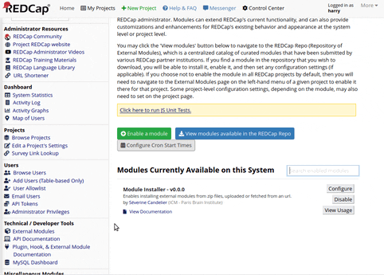

# REDCap Module Installer

This module allows an administrator to install a REDCap module from the administration web interface, by providing a zip file. This file can be uploaded from your computer [FUTURE IMPROVEMENT] or fetched from a URL (a release file in a Github/Gitlab repo for example)[/FUTURE IMPROVEMENT].

## Motivation

REDCap modules are a great way to extend REDCap's functionalities. However, installing a module which is not available in the [REDCap External Module Repository](https://redcap.vanderbilt.edu/consortium/modules/index.php) requires to have access to the server, which is not always easy or even possible.

This module allows an administrator to install such module directly from the REDCap web interface.

Of course, doing so requires to trust the module's author, or to perform a code verification. This module does not check in any way the module's code, it only checks the module's metadata (name, installation path and version).

Its primary use case is to install modules developed by the institution's IT department, or by a trusted third party, which are not intended to be publicly distributed in the REDCap repo.

## Prerequisites

* PHP >= 7.4
* REDCap >= 10.8.2 (Module Framework version >= 7)

## Installation

### Installation through the REDCap External Module Repository

This module is not available on the [REDCap Repo](https://redcap.vanderbilt.edu/consortium/modules/index.php).

### Manual Installation
- Clone this repo into `<redcap-root>/modules/module_installer_v0.0.0`.
  Or, alternatively, download the release .zip file of this repo, unzip into `<redcap-root>/modules/`, and rename the module folder to `module_installer_vX.Y.Z` (X.Y.Z being the release version).

- Go to **Control Center > External Modules** and enable Module Installer.

This module adds a "Module Installer" link in the Control Center's sidebar (last section, "External Modules").

### Installation via this very module

This is the goal of this module, after all!

If you don't have the module installed yet, you will need to do a first manual installation (see above).

Then, you can install any new version from the "Module Installer" link in the Control Center's sidebar (see below).

## Features

* The user must have the rights to install a module (needs to be a REDCap Administrator, and have the "Install, upgrade, and configure External Modules" privilege).
* Upload module zip file from your computer.
* Check the module's metadata (name, installation path and version)
* Check if the module is already installed in the same path and version in the `redcap/modules` folder. If so, the module is not installed.
* Allows to choose the installation path, with version, inside the `redcap/modules` directory. 
* Finally, installs the module in the chosen path.

.

## Security

No verification is done on the zip, except that it contains a `config.json` file under a parent directory.

It is your responsibility to make sure that the zip file contains a valid and safe REDCap module.

:warning: **NEVER INSTALL A MODULE FROM AN UNTRUSTED SOURCE** :see_no_evil:

## Development Roadmap

The further improvements of this module will be:

### v1.1

- [ ] Download a zip file from a URL
- [ ] Add a breadcrumb to see the different steps

### v1.2

- [ ] Provide API endpoints (providing url, path & version)

